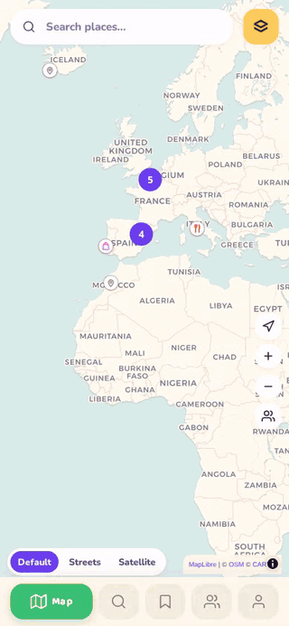

<div align="center">

# 📍 Pinna

### The place-saving app that actually feels fun to use.

Stop losing your favorite spots in a boring list. Save them on a map that has personality — chunky ink outlines, a cream-paper world, and buttons that press down like they mean it. Open source, self-hostable, and built to be shared with the people you actually travel and eat with.

[](./LICENSE)
[](https://vuejs.org)
[](https://maplibre.org)
[](https://github.com/Osyna/Pinna/pulls)

**[✨ Try the live demo →](https://maps.osyna.sh)**



</div>

---

## Why Pinna?

Every mapping app lets you "save a place." Almost none of them make you *want* to open the app again.

- 🎨 **It's actually delightful.** A hand-tuned cartoon UI — not a reskinned Google Maps clone — with motion, color, and personality on every screen.
- 🗺️ **Your places, organized like they matter.** Categories, star ratings, tags, notes, and custom lists ("Someday, Somewhere") — not a flat pin dump you'll never scroll through again.
- 👯 **Built to share.** Add a friend by their ID and their pins land right on your map. See who else has already been to the place you're about to try.
- ♿ **Accessible by design.** Every category is an icon *and* a color — never color alone — on markers, legends, and popups.
- 🧩 **Actually open.** No walled garden, no ads, no tracking. Self-host it in five minutes with Docker, or fork it and make it yours.
- ⚡ **Fast, for real.** Hundreds of saved places render instantly with dynamic loading, a shared geo-cache, and offline-ready map tiles — it stays snappy at any scale.

## 🚀 Live Demo

Try it right now, no install needed: **[maps.osyna.sh](https://maps.osyna.sh)**

**Shared demo login** (a public sandbox — feel free to explore and add a few pins of your own):
- **Email:** `test@test.com`
- **Password:** `test@test.com`

*It's a shared account, so please be kind to it — for your own private map, registering a free account takes ten seconds.*

## Features

| | |
|---|---|
| 🎮 **Cartoon Game UI** | 3px ink outlines, cream paper, `Baloo 2` display type, pop/bob animations, and buttons that physically press down. Every tab has its own identity color that carries through its whole screen. |
| 🗺️ **Interactive Map** | MapLibre GL with Default, Streets, and Satellite layers, buttery fly-to animations, and marker clustering that scales to thousands of pins. |
| 🎯 **Icons + Colors, Always Together** | Every category — on the map, in the legend, in popups — is encoded by an icon *and* a color. Never color alone. |
| 🔍 **Real Place Search** | Search addresses via Nominatim and discover restaurants, cafés, bars, and more from OpenStreetMap, anywhere in the world or right around you. |
| 📌 **Save Anything, Fast** | Tap anywhere on the map to save a spot with notes, a star rating, cuisine, tags, and a website link. |
| 🗂️ **Categories & Lists** | 13 built-in categories, each with its own icon and color, fully customizable — plus custom lists like "Someday, Somewhere" to plan future trips. |
| 👥 **Friends** | Add friends by their user ID, browse their maps, and see at a glance when a friend has already saved the place you're looking at. |
| 🧭 **Directions** | One-tap driving routes to any saved place via OSRM. |
| 🗑️ **Recoverable Deletes** | Deleted a place by mistake? It sits in Recently Deleted for 30 days before it's really gone. |
| 📤 **Import & Export** | Export everything to JSON, import from file — including Google Maps Takeout and Mapstr exports. |
| 🔐 **Real Accounts** | JWT-authenticated accounts with avatars, favorite cuisines, and favorite places, backed by PostgreSQL — your data is actually yours. |
| 📱 **Installable & Offline-Ready** | A real PWA: install it to your home screen, and browse your saved places and cached map tiles even with no signal. |

## Screenshots

| A world of saved places | Every tab, its own color |
| :---: | :---: |
|  |  |

| Rich place details | Search & discover |
| :---: | :---: |
|  |  |

| Your places, organized | Places are better shared |
| :---: | :---: |
|  |  |

<div align="center">


</div>

## Getting Started

### Prerequisites

- Node.js 18+
- npm
- PostgreSQL (for the API server)

### Development

```bash
npm install
cp .env.example .env   # set DATABASE_URL + JWT_SECRET
npm run dev:all        # frontend (Vite) + API server together
```

Frontend only:

```bash
npm run dev
```

### Build

```bash
npm run build
npm run preview
```

### Docker

```bash
docker build -t pinna .
docker run -p 8080:80 -e DATABASE_URL=postgres://... pinna
```

Then open http://localhost:8080 — your own Pinna, running in one command.

## Tech Stack

| Frontend | Backend | Infra |
|---|---|---|
| Vue 3 (Composition API) | Express | PostgreSQL + Prisma |
| Vite | JWT auth | Nginx (Docker) |
| MapLibre GL | Nominatim / Overpass / OSRM (self-cached proxy) | GitHub Actions CI |
| Pinia | | |

## Design

The cartoon UI was designed in [Claude Design](https://claude.ai/design) ("Cartoon game UI overhaul") and implemented 1:1 in Vue: the design tokens, category icon set, and motion language live in [`src/styles/cartoon.scss`](./src/styles/cartoon.scss) and [`src/categoryIcons.js`](./src/categoryIcons.js).

## Contributing

Pinna is open source under GPLv3 — issues, pull requests, and forks are genuinely welcome. If you build something with it or find a bug, [open an issue](https://github.com/Osyna/Pinna/issues).

If Pinna made you smile, a ⭐ on the repo goes a long way.
