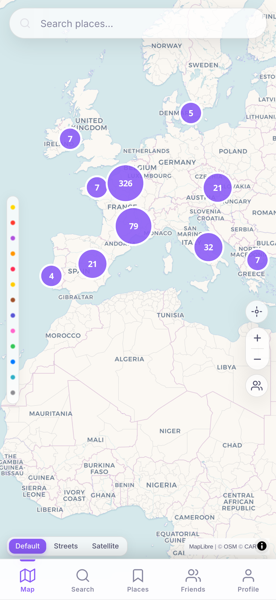
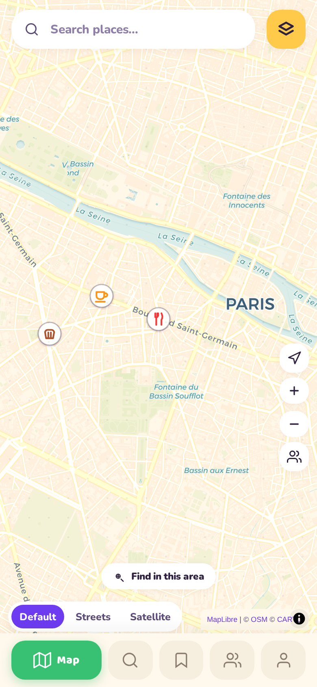
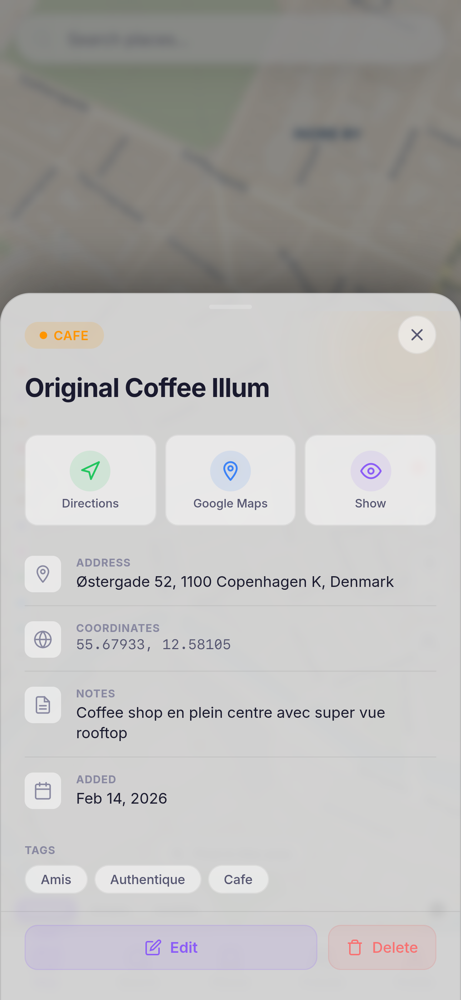
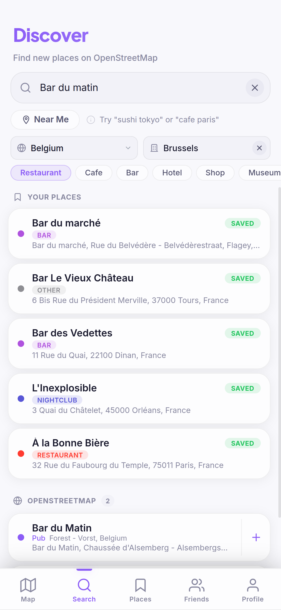
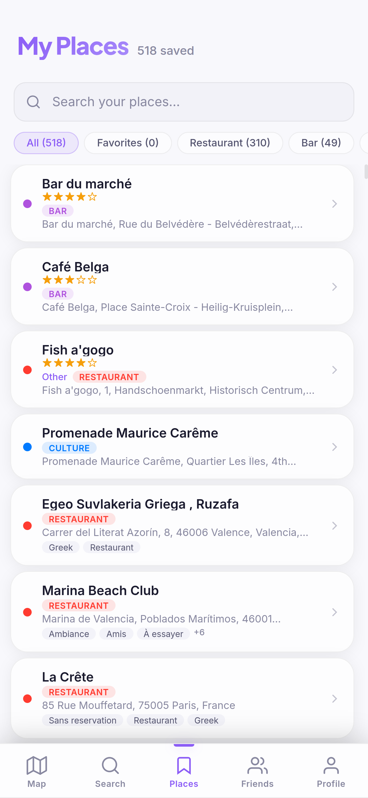
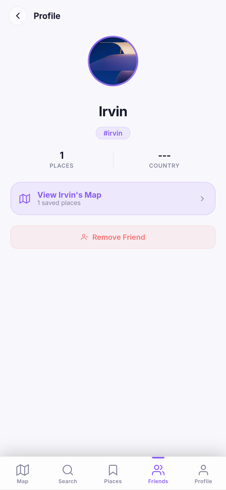
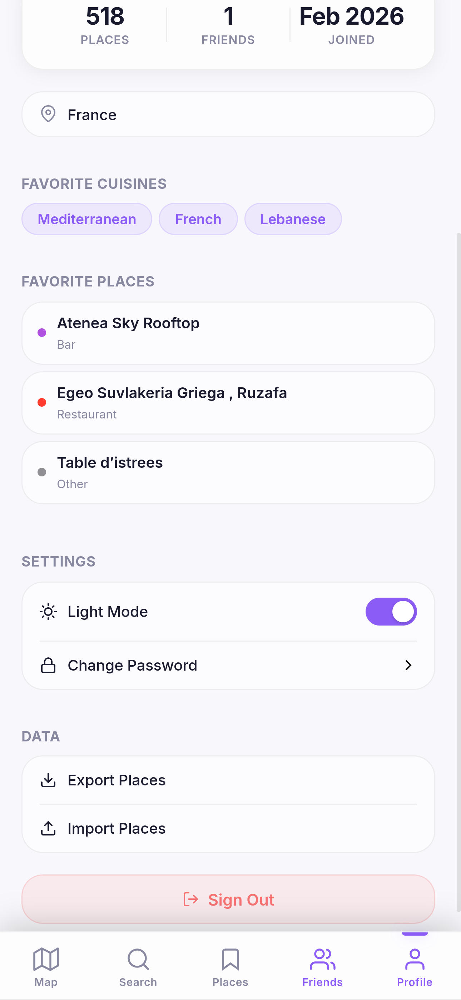

# Pinna

Open-source mapping application built with Vue 3, Vite, and OpenStreetMap. A free alternative to proprietary mapping apps, with no account required for local usage.



## 🚀 Live Demo

You can try the live demo at: **[maps.osyna.com](https://maps.osyna.com)**

**Credentials for testing:**
- **Email:** `test@test.com`
- **Password:** `test@test.com`

## Features

- **Interactive Map** - Full OpenStreetMap integration via Leaflet with dark, street, and satellite tile layers.
- **Place Search** - Search addresses and places using the Nominatim geocoding API.
- **Save Places** - Click anywhere on the map to save locations with names, notes, and categories.
- **Categories** - Organize saved places into categories (Favorites, Food & Drink, Shopping, Nature, Culture, Other).
- **Directions** - Get driving routes between saved places using OSRM.
- **Import/Export** - Export all saved places to JSON, import from file.
- **Local Storage** - All data stored in browser localStorage or synced with a backend.
- **Dark Theme** - Modern, sleek dark UI designed for better visibility.
- **Cartoon Mode** - A playful, cartoon-game skin (chunky ink outlines, cream paper, Baloo 2 headings). Toggle it in Profile → Settings.

## Screenshots

| Map View | Place Details |
| :---: | :---: |
|  |  |

| Search | My Places |
| :---: | :---: |
|  |  |

| Friends | Profile |
| :---: | :---: |
|  |  |

## Getting Started

### Prerequisites

- Node.js 18+
- npm

### Development

```bash
npm install
npm run dev
```

### Build

```bash
npm run build
npm run preview
```

### Docker

```bash
docker build -t mappsly .
docker run -p 8080:80 mappsly
```

Then open http://localhost:8080

## Tech Stack

- **Vue 3** - Composition API for modern frontend logic.
- **Vite** - High-performance build tool.
- **Leaflet** - Flexible map rendering.
- **Pinia** - Intuitive state management.
- **OpenStreetMap** - Global open tile data.
- **Nominatim** - Accurate geocoding & search.
- **OSRM** - Efficient routing service.
- **Nginx** - Production-ready serving (Docker).


